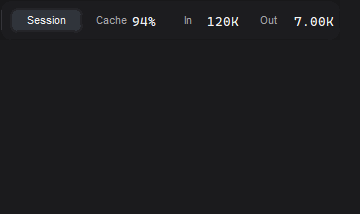

# Codex Token Overlay

[中文说明](README.zh-CN.md)



> **Unofficial / Not affiliated with OpenAI.**

A small Windows always-on-top HUD for Codex Desktop / Codex CLI token usage. It reads local rollout JSONL files and never calls an API.

## Privacy

- Read-only access to local Codex session files under `~/.codex/sessions` and `~/.codex/archived_sessions`.
- Does **not** read `auth.json`, API keys, `.env` files, prompts outside the rollout file, or credentials.
- The application makes no network connections. GitHub, Python and PyInstaller are only used for distribution/building.
- Settings contain only window coordinates and UI preferences: `%LOCALAPPDATA%\CodexTokenOverlay\settings.json`.
  UI preferences include `expanded`, `scope`, `language` (`auto`, `en`, `zh-CN`) and `always_on_top`. `Auto` follows the Windows UI language; an explicit English/Chinese choice is remembered until changed back to `Auto`.

## Download

Download `CodexTokenOverlay-v0.3.0-windows-x64.exe` from [Releases](https://github.com/wenyuan05/codex-token-overlay/releases). It is a portable, unsigned Windows x64 executable; SmartScreen may show a first-run warning.

Verify the download with `SHA256SUMS.txt`:

```powershell
Get-FileHash .\CodexTokenOverlay-v0.3.0-windows-x64.exe -Algorithm SHA256
```

Double-click the EXE. The compact HUD shows only scope, Cache, In and Out; click the body to expand the detailed panel. Click Current/Session to switch scope without expanding. Drag from the background to move it; a right-click opens the native menu for scope, Always on top, startup, language, reset position, copy and Quit. The tray icon provides Show/Hide, scope, Start with Windows, Language (Auto/English/Simplified Chinese), About and Quit. Startup is opt-in and uses the current user's registry only. Position and UI preferences persist across launches.

## Run from source

Python 3.10+ with Tk is required:

```powershell
py -3 -m pip install -r requirements-runtime.txt
py -3 codex_hud.py
py -3 codex_hud.py --once --debug
py -3 codex_hud.py --once --file .\sample_rollout.jsonl --lang en
```

Language defaults to the Windows UI language (`zh-*` → Simplified Chinese, otherwise English). Override with `--lang auto`, `--lang zh-CN` or `--lang en`.

## Build

On Windows PowerShell:

```powershell
Set-ExecutionPolicy -Scope Process Bypass
.\build.ps1
```

The result is `dist\CodexTokenOverlay.exe` plus `dist\SHA256SUMS.txt`. The same checks run in GitHub Actions.

## Controls and metrics

- Click the body or press Space: expand/collapse.
- Drag the body: move and persist the HUD position.
- Click Turn/Session: switch current-turn or cumulative-session metrics.
- Middle-click/Ctrl+C: copy visible text. Right-click/Escape: hide to tray.
- Cache hit is `cached_input_tokens / input_tokens`.
- Current-turn usage prefers exact `raw_response_completed` usage and otherwise uses cumulative deltas.
- Tool time is an interval union, so overlapping tools are not double-counted.
- Tool events are normalized from response-item call/output pairs, legacy begin/end events, and future `item_started/item_completed` wrappers.
- Automatic selection follows the latest eligible root user thread and excludes subagent/memory-consolidation sessions; `--file` overrides selection.
- Token usage may remain pending until Codex persists a `token_count` or response-usage event.

## License

MIT. See [LICENSE](LICENSE).
