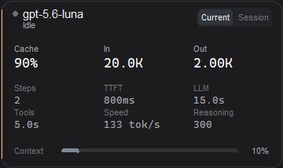

# Codex Runtime HUD

[中文说明](README.zh-CN.md)



> **Unofficial / Not affiliated with OpenAI.**

A Windows always-on-top HUD focused on real-time, single-turn performance for Codex Desktop / Codex CLI. It follows the active root user rollout as JSONL is appended and never calls an API.

## What it monitors

The default view is the current turn, not a historical dashboard. While a turn is running, the HUD surfaces LLM elapsed time, TTFT, tool time, Steps, token speed, input/output tokens, cache hit and context usage. Session cumulative metrics remain available as a secondary comparison view.

## Privacy

- Read-only access to local Codex session files under `~/.codex/sessions` and `~/.codex/archived_sessions`.
- Does **not** read `auth.json`, API keys, `.env` files, prompts outside the rollout file, or credentials.
- The application makes no network connections. GitHub, Python and PyInstaller are only used for distribution/building.
- Settings contain only window coordinates and UI preferences: `%LOCALAPPDATA%\CodexRuntimeHUD\settings.json`.
  UI preferences include `expanded`, `scope`, `language` (`auto`, `en`, `zh-CN`), `always_on_top` and local session-selection mode. `Auto` follows the Windows UI language; an explicit English/Chinese choice is remembered until changed back to `Auto`.
- Existing settings from `%LOCALAPPDATA%\CodexTokenOverlay\settings.json` are read as a one-way compatibility fallback; new saves use the `CodexRuntimeHUD` folder.

### Session status limitations

Session status is inferred only from local rollout lifecycle events. `Active` means the latest root turn has started without a matching `task_complete`, `turn_complete` or abort event and the rollout was written recently. A newer turn supersedes an unmatched older turn, and duplicate rollout files for the same stable thread are merged in the picker. Codex may pause without appending JSONL, so a quiet unfinished turn is shown as **Running (waiting for update)** in blue. If no new write is observed for 24 hours, it is treated as **Idle** to prevent interrupted historical rollouts from appearing active forever. The HUD also cannot know which Desktop tab currently has focus.

## Download

Download the latest portable Windows x64 executable from [Releases](https://github.com/wenyuan05/codex-runtime-hud/releases). The historical v0.3.1 asset keeps its legacy filename; new builds use the `CodexRuntimeHUD` name. The executable is unsigned, so SmartScreen may show a first-run warning.

Verify the download with `SHA256SUMS.txt`:

```powershell
Get-FileHash .\CodexRuntimeHUD.exe -Algorithm SHA256
```

Double-click the EXE. The compact HUD shows a Sessions button, scope, Cache, In and Out; click the body to expand the detailed panel. Click Sessions to open a scrollable local root-session list. `Follow automatically` keeps the stable latest-root behavior; selecting a session locks the HUD to that session until you select Auto again. Session rows use only the local `cwd` project folder plus a short thread ID, never prompt text. Click Current/Session to switch scope without expanding. Drag from the background to move it; a right-click opens the native menu for scope, sessions, Always on top, startup, language, reset position, copy and Quit. The tray icon mirrors Sessions alongside Show/Hide, Start with Windows, Language, About and Quit. Startup is opt-in and uses the current user's registry only. Position and UI preferences persist across launches.

## Run from source

Python 3.10+ with Tk is required:

```powershell
py -3 -m pip install -r requirements-runtime.txt
py -3 codex_runtime_hud.py
py -3 codex_runtime_hud.py --once --debug
py -3 codex_runtime_hud.py --once --file .\examples\sample_rollout.jsonl --lang en
```

Language defaults to the Windows UI language (`zh-*` → Simplified Chinese, otherwise English). Override with `--lang auto`, `--lang zh-CN` or `--lang en`.

## Build

On Windows PowerShell:

```powershell
Set-ExecutionPolicy -Scope Process Bypass
.\scripts\build.ps1
```

The result is `dist\CodexRuntimeHUD.exe` plus `dist\SHA256SUMS.txt`. The same checks run in GitHub Actions.

## Controls and metrics

- Click the body or press Space: expand/collapse.
- Click Sessions: choose an eligible local root thread, or return to automatic following.
- Drag the body: move and persist the HUD position.
- Click Turn/Session: switch current-turn or cumulative-session metrics.
- Middle-click/Ctrl+C: copy visible text. Right-click/Escape: hide to tray.
- Cache hit is `cached_input_tokens / input_tokens`.
- Current-turn usage prefers exact `raw_response_completed` usage and otherwise uses cumulative deltas.
- Tool time is an interval union, so overlapping tools are not double-counted.
- Tool events are normalized from response-item call/output pairs, legacy begin/end events, and future `item_started/item_completed` wrappers.
- Automatic selection follows the latest eligible root user thread and excludes subagent/memory-consolidation sessions. A manual selection is locked until switched back to Auto; `--file` overrides both modes.
- Session status is an estimate from persisted events, not a process monitor; blue **Running (waiting for update)** means “the latest turn is unfinished but recently quiet,” not a guarantee that the task is still executing. Unmatched turns with no writes for 24 hours are treated as idle.
- Large rollouts are scanned incrementally for turn metadata, so a newer turn in the middle of a file is not mistaken for stale startup data.
- Token usage may remain pending until Codex persists a `token_count` or response-usage event.

## License

MIT. See [LICENSE](LICENSE).

## Repository layout

- `codex_runtime_hud.py`, `overlay_ui.py`, `icon_assets.py`: application source.
- `tests/`: parser, icon and UI-settings unit tests.
- `scripts/`: build, launcher and demo-capture scripts.
- `packaging/`: PyInstaller spec and Windows version metadata.
- `docs/releases/`: versioned release notes.
- `examples/`: safe sample rollout used by tests and CLI smoke tests.
